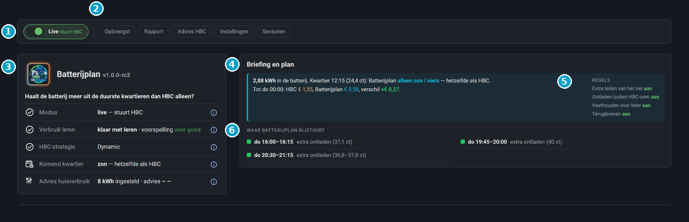

# 02 · Het dashboard

*English: [02-dashboard.md](02-dashboard.md) · Deutsch: [02-dashboard.de.md](02-dashboard.de.md)*

**In het kort**
- Het dashboard zit in de integratie. Het staat in de zijbalk als **Batterijplan**, op `/batterijplan`. De kaarten zijn ingebouwd: geen bron, geen bestand, niets om te plakken.
- De startpagina beantwoordt één vraag: *wat doet Batterijplan nu, en haalt hij meer uit de batterij dan HBC alleen?* Alles past op één scherm.
- Bovenaan staat een rij knoppen. Opbrengst, instellingen, het rapport en de sensoren zitten achter een knop en openen als venster.
- Elke eigen kaart heeft een **(i)** naast de titel, en op de statuskaart en in de instellingen heeft ook elke regel er een. Klik erop voor het venster *Hoe lees je dit?* Ga met de muis over een cijfer met een stippellijn voor een korte toelichting.
- De kleuren zijn overal gelijk. De legenda van de grafiek legt ze uit.

1. **Live**: aan = Batterijplan stuurt HBC. Uit = schaduwmodus: het rekent mee, maar stuurt niets.
2. **Knoppen**: Opbrengst, Rapport, Advies HBC, Instellingen en Sensoren. Elke knop opent een venster. De oranje stip op **Advies HBC** betekent dat *cheapest hrs*, *expensive hrs* of *Solar reserved for house* afwijkt van het advies (minstens 1 uur of 0,5 kWh); in het venster staat ook de schakelaar *HBC-instellingen automatisch*.
3. **Statuskaart**: modus, verbruik leren, HBC-strategie, komend kwartier en advies huisverbruik. De (i) achter elke regel legt hem uit.
4. **Briefing en plan**: wat er nu in de batterij zit, wat het plan het komende kwartier doet en het verschil met HBC alleen.
5. **Regels**: de vier regels, elk met een eigen aan/uit-schakelaar.
6. **Waar Batterijplan bijstuurt**: de blokken waarin het plan iets anders doet dan HBC.

De pagina heeft vier delen:
1. de knoppenrij;
2. de statuskaart;
3. de briefing, in twee kolommen, met de regels rechts;
4. de grafiek over de volle breedte: HBC alleen en Batterijplan.

## De knoppenrij

| Knop | Wat hij doet |
|---|---|
| **Live** (eigen schakelaar, vooraan) | Groen en aan = Batterijplan stuurt HBC. Uit = schaduwmodus: hij rekent mee, maar stuurt niets. |
| **Opbrengst** | Opent *Wat levert het op*. |
| **Instellingen** | Opent de instellingen, met de tabbladen **Basis**, **Regels** en **Expert**. |
| **Rapport** | Opent het rapport van het plan. |
| **Sensoren** | Opent de sensornamen, de controle *huisverbruik nu* en de uitleg. |

Een **oranje stip** op een knop betekent: hier is iets te doen. Bijvoorbeeld een instelling die niet is ingevuld of een sensor die niets meldt. Geen stip betekent dat alles goed staat.

Een venster sluit je met **‹ Terug** of ✕ bovenin, met een klik ernaast of met Esc. Het venster *Hoe lees je dit?* sluit je op dezelfde manier; je komt dan terug waar je was.

## Statuskaart

Bovenaan het logo, de naam en de versie, met de vraag die Batterijplan beantwoordt. Elke regel heeft rechts een **(i)** met uitleg.

| Regel | Betekenis |
|---|---|
| Modus | **live** — stuurt HBC, of **schaduw** — rekent mee, stuurt niets. |
| Verbruik leren | Tijdens het leren bijvoorbeeld "leren · dag 3 van 7 · voorspelling redelijk". Na 7 dagen: "klaar met leren · voorspelling goed". |
| HBC-strategie | Moet **Dynamic** zijn. Staat er iets anders? Dan stuurt Batterijplan niets. |
| Komend kwartier | Wat het plan doet in het komende kwartier, naast wat HBC alleen zou doen. |

**De voorspelling** zegt hoe goed het geleerde verbruik klopt met het echte verbruik, per blok van 3 uur. Je ziet alleen een oordeel, geen percentage:

| Oordeel | Kleur |
|---|---|
| nog aan het meten | gewone tekst |
| wisselvallig | gewone tekst |
| redelijk | lichtgroen |
| goed | groen |
| zeer goed | donkergroen |
| uitstekend | het donkerste groen |

## De briefing

- Bovenaan drie getallen: **Kale prijs nu**, **Verwachte besparing t.o.v. HBC alleen** en **In de batterij nu**.
- *In de batterij nu* volgt de batterij live (stappen van 0,1 kWh); het plan en de grafiek houden de geplande lading.
- Daaronder **Waar Batterijplan bijstuurt**: de blokken in woorden waarin het plan iets anders doet dan HBC, bijvoorbeeld "di 08:30–10:30 vasthouden voor later". Niets te doen: HBC doet zijn gewone werk.
- Rechts de **Regels**: de vier regels, elk met een eigen aan/uit-schakelaar. Zie [03 · Hoe het werkt](03-how-it-works.nl.md#de-regels).
- Het plan kijkt maximaal 36 uur vooruit. Morgen verschijnt zodra HBC de prijzen van morgen heeft (meestal rond 13:00).

## De grafiek

De grafiek staat over de volle breedte en toont HBC alleen en Batterijplan naast elkaar.

- De grijze lijn is de kale stroomprijs per kwartier, zoals HBC hem geeft.
- De gekleurde vlakken zijn de kwartieren waarin Batterijplan iets doet.
- De **lading** in kWh: wat de batterij zou doen met HBC alleen, en wat hij doet met het plan. De verwachte zon is de beste schatting van Solcast.
- De lijn *Nu* scheidt verleden en toekomst. Links ervan is wat gedimd.
- De **datumkiezer** staat rechts in de kopregel. Kies *Nu* of een andere dag en blader met ‹ ›.
- De kop toont de cijfers: de feiten, de besparing en de kWh.
- Ga met de muis over de grafiek (op een telefoon: tik erop). Een verticale lijn volgt je aanwijzer en een klein vak toont voor dat kwartier: de tijd, de kale prijs (ct), de verwachte zon in kW (de gewone schatting en de voorzichtige schatting die het plan gebruikt), de lading van HBC en van Batterijplan (kWh) en wat HBC en Batterijplan doen. Alleen de lijn en het vak bewegen, de kaart wordt niet opnieuw getekend. Op een telefoon verdwijnt het vak als je ergens anders tikt.

**Het verschil met HBC alleen** staat in euro. Meer dan 0 is **+ € 0,35** in groen, precies 0 is **€ 0,00** in grijs, minder dan 0 is **– € 0,02** in oranje. Dezelfde regel geldt voor de bedragen in *Wat levert het op*.

## Vensters achter de knopjes

**Wat levert het op**

| Regel | Betekenis |
|---|---|
| Totaal sinds … | De geschatte meerwaarde bovenop HBC alleen. |
| Dit contractjaar | Hetzelfde, vanaf de ingangsdatum van je contractjaar. |
| waarvan schaduw | Wat het had opgeleverd terwijl *Live* uit stond. Dat geld heb je niet echt verdiend. |
| waarvan live | Wat het opleverde terwijl Batterijplan echt stuurde. |
| Kwartieren vastgehouden / teruggeleverd / ontladen | Hoe vaak Batterijplan elk van de drie dingen deed. |

Het is een schatting: zie [03 · Hoe het werkt](03-how-it-works.nl.md#de-teller-meerwaarde).

**Instellingen**

Drie tabbladen, met eigen invoervelden en een (i) naast elk veld:

| Tabblad | Wat staat erop |
|---|---|
| **Basis** — instellen en vergeten | Bruikbare capaciteit, veiligheidsmarge, *Prijzen van HBC* (*kaal* of *all-in*), opslag en ingangsdatum. |
| **Regels** | De vier regels met hun aan/uit-schakelaar. |
| **Expert** — alleen wijzigen als je weet waarom | Btw, toeslag terugleveren, dagbonus terugleveren en de uren voor die bonus. |

Hier staat ook de schakelaar *HBC-instellingen automatisch* (standaard uit): die zet de drie HBC-instellingen op het advies en zet jouw eigen waarden terug als je hem uitzet. De twee velden voor de zonvoorspelling-sensoren staan in het venster *Sensoren*.

De uitleg per veld staat ook in [01 · Installatie](01-installation.nl.md#stap-3--integratie-toevoegen). Alle instellingen worden door de integratie bewaard: zie [04 · Onderhoud](04-maintenance.nl.md#back-up).

**Rapport**

Het geschreven rapport van het plan.

**Sensoren**

De namen van je sensoren voor net, zon, batterij en (optioneel) laadpaal. Onder elke naam zie je wat die sensor nu meldt. Onderaan de controle *huisverbruik nu*.

## Je eigen dashboard

De entiteiten hebben vaste namen (`sensor.batterijplan`, `switch.batterijplan_live`, enzovoort) en de kaarten worden overal in Home Assistant geladen. Je kunt de kaarten dus ook in je eigen dashboards gebruiken. De kaarten komen in twee bestanden, `batterijplan-cards.js` en `batterijplan-plan-card.js`. De kaarten hebben een optionele instelling `taal` (`nl`, `en` of `de`) die de taal van die kaart bepaalt; zonder die instelling volgt de kaart de taal van je Home Assistant-profiel.
